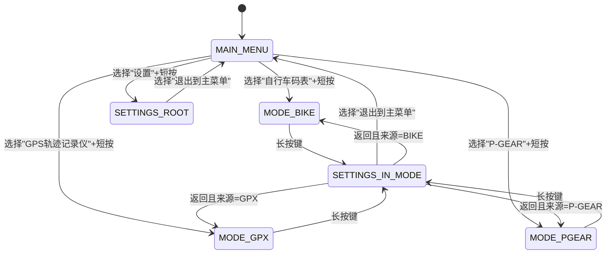
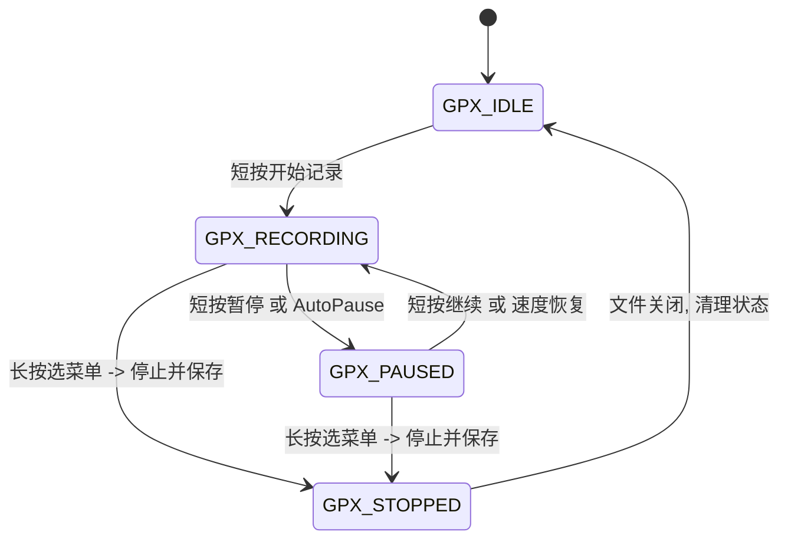
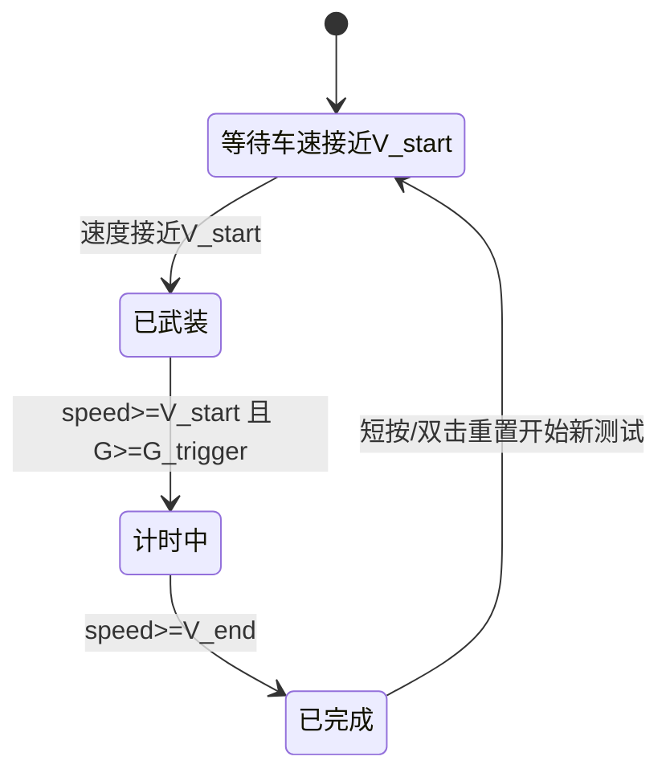
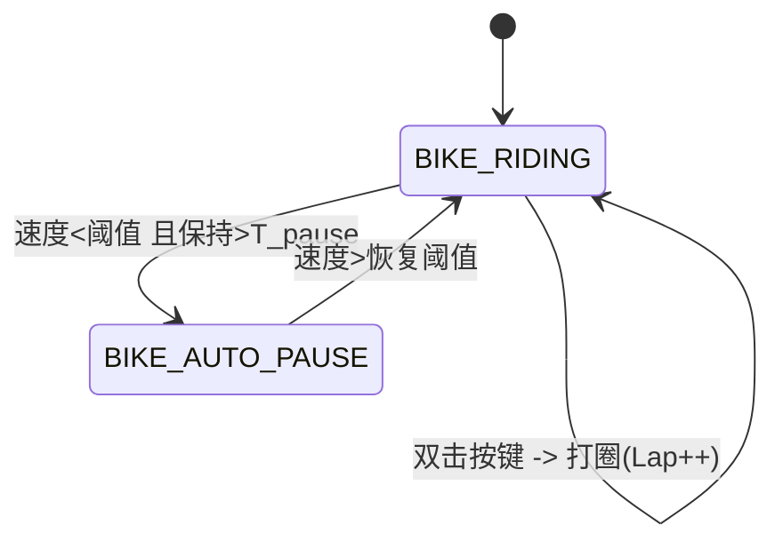
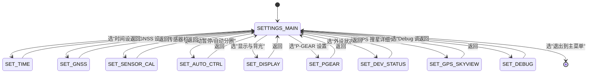

下面是一份**已经整合 UI 草图 + 状态机 + 全部之前需求修改**的完整软件需求规格书（SRS）。
可以直接作为「让 AI 开始写代码」的唯一权威文档。

---

# ESP32S3 三合一设备

## 软件需求规格书（SRS）v1.0

---

## 0. 概述

* **设备功能集：**

  1. 自行车码表（Bike Computer）
  2. GPS 轨迹记录仪（GPX Recorder）
  3. P-GEAR 汽车 0–100 加速测试

* **硬件平台：**

  * SoC：ESP32-S3FH4R2（4MB Flash，2MB PSRAM）
  * GNSS：NEO-M8N（UART1）
  * IMU：LSM6DSR（I2C，6 轴）
  * 磁力计：LIS2MDL（I2C）
  * 气压计：BMP388（I2C）
  * 显示：ST7789 240×320 竖屏（旋转 180°）
  * 存储：SD 卡，4-bit SDIO
  * 输入：旋转编码器 + 单按键
  * 电源相关：电池 ADC，充电状态引脚

* **软件环境：**

  * ESP-IDF v6.1
  * FreeRTOS
  * LVGL（UI 框架）
  * LovyanGFX（显示驱动）

* **风格要求：**

  * 代码语言：C 为主，可封装少量 C++
  * 代码注释：**必须使用中文**
  * 模块分层清晰，接口规范，便于 AI 生成和维护

---

## 1. 硬件资源与外设

### 1.1 GPIO 分配（固定）

| 模块          | 信号                  | GPIO        | 说明                     |
| ----------- | ------------------- | ----------- | ---------------------- |
| 调试串口        | DEBUG_TX / DEBUG_RX | 43/44       | UART0@115200           |
| GNSS        | GNSS_TX / GNSS_RX   | 17/18       | UART1，与 NEO-M8N 相连     |
| GNSS 电源     | GPS_LDO_EN          | 14          | 高电平上电                  |
| I2C0        | SCL / SDA           | 39/40       | 1 MHz，总线挂 IMU/MAG/BARO |
| IMU LSM6DSR | I2C 地址              | 0x6A        |                        |
| MAG LIS2MDL | I2C 地址              | 0x1E        |                        |
| BARO BMP388 | I2C 地址              | 0x76        |                        |
| LCD SPI3    | SCK / MOSI          | 5/8         | LovyanGFX 接口           |
|             | CS / DC             | 7/6         | 片选 / 数据命令              |
|             | RST / BL            | 4/9         | 背光 BL 为 PWM 输出         |
| SDIO        | D0~D3 / CMD / CLK   | 37–34/35/36 | 4-bit SDIO             |
| 旋转编码器       | ENC_A / ENC_B       | 1/3         | 上拉                     |
| 主按键         | KEY_MAIN            | 2           | 上拉                     |
| 电池检测        | BAT_ADC             | 12          | 1:1 分压输入               |
| 充电状态        | CHRG_STATUS         | 21          | 输入                     |

### 1.2 显示屏

* 控制器：ST7789
* 分辨率：240×320
* 方向：竖屏，软件配置旋转 180°
* 接口：SPI3 + 背光 PWM（GPIO9，2 kHz，默认 50%）

---

## 2. 输入设备与交互逻辑

### 2.1 主按键（KEY_MAIN）事件定义

按键必须支持 5 种事件类型：

| 事件名        | 条件（按下时长）              | 主要用途                     |
| ---------- | --------------------- | ------------------------ |
| 短按（CLICK）  | < 300 ms              | 菜单选择 / 一般确认              |
| 双击（DOUBLE） | 400 ms 窗口内两次短按        | BIKE：打圈；GPX：打点           |
| 中按（MID）    | ≈ 1 s（例如 700–1300 ms） | BIKE 中切换次要视图 / 替代功能（可扩展） |
| 长按（LONG）   | ≥ 1.5 s 且 < 8s        | 进入设置页面（Settings）         |
| 超长按（ULTRA） | ≥ 8 s                 | 系统级功能（预留，如恢复出厂设置/重启等）    |

要求：

* 实现**100 ms 消抖**。
* 时间窗口重叠时，优先级：ULTRA > LONG > DOUBLE > MID > CLICK。
* 所有按键事件产生时，必须立即输出一条 UART0 事件日志（见心跳与日志章节）。

### 2.2 旋转编码器

* 每 **4 个脉冲计为 1 步**（防止太灵敏）。
* 若两步之间间隔 ≥ 1000 ms，则清零累计脉冲计数，避免极慢/干扰造成误触。
* 功能：

  * 在主菜单 / 设置菜单中：上下移动光标。
  * 在 BIKE 模式：切换数据页面/高亮字段。
  * 在 GPX 模式：切换信息页/文件页。
  * 在 P-GEAR 模式：切换视图（实时/历史）。

---

## 3. 时间与 RTC 系统

1. 软件维护一个 RTC（实时时钟）。
2. 上电首次启动时，RTC 默认时间为编译时间 `__DATE__` + `__TIME__`。
3. 设置页面提供“时间设置”，允许用户手动设置年月日时分秒。
4. 时间源选项：

   * GNSS 自动同步
   * 仅手动设置
5. GNSS 有效定位且时间有效时，若时间源为 GNSS 自动同步：

   * 自动同步 RTC。
   * **首次成功同步时，在 UI 上显示“时间同步完成”指示 2 秒。**
6. 所有 GPX `<time>` 时间戳必须统一使用 RTC 时间（UTC 或本地需在实现中统一说明）。

---

## 4. GNSS（NEO-M8N）需求

### 4.1 初始化 & 配置流程

1. 拉高 GPS_LDO_EN（GPIO14），延时 ≥ 100 ms。

2. UART1 以 9600 bps 接收 NMEA。

3. 通过 UBX 指令配置波特率为 115200 bps，并保存配置。

4. 重新初始化 UART1 为 115200 bps。

5. 星座模式和更新率由设置界面控制：

   * 星座模式：

     * GPS
     * GPS + BeiDou
     * GPS + GLONASS
   * 更新率：

     * 1 Hz
     * 5 Hz

6. 至少启用 GGA、RMC；建议结合 UBX 消息用于 DOP 信息提取。

### 4.2 数据结构

```c
typedef struct {
    uint32_t timestamp_ms;
    double   lat;      // 纬度，度
    double   lon;      // 经度，度
    float    alt;      // GNSS 高度，m
    float    speed;    // 水平速度，m/s
    float    course;   // 航向，度 0~360
    float    hdop;     // 水平精度
    float    vdop;     // 垂直精度
    float    pdop;     // 位置精度
    uint8_t  sats;     // 使用卫星数
    uint8_t  fix;      // 0: 无 / 2: 2D / 3: 3D ...
    bool     valid;    // 定位是否有效
} gnss_fix_t;
```

### 4.3 状态判断与 NMEA_OK

* `fix >= 2` 且 DOP 合理时，认为 `valid = true`。
* 定义 `NMEA_OK`：

  * 在最近 5 秒内接收到并成功解析 ≥ 1 条有效 GGA 或 RMC，则 NMEA_OK = 1；否则 0。
* 心跳日志中必须包含 `NMEA_OK` 状态。

---

## 5. 传感器系统（IMU / MAG / BARO）

### 5.1 坐标系约定

定义统一车体坐标系：

* X：前进方向
* Y：左侧
* Z：向上

所有传感器数据必须转换到该坐标系下。

### 5.2 IMU（LSM6DSR）

* 接口：I2C 地址 0x6A
* 配置：

  * ODR：104 Hz
  * 加速度量程：±4g
  * 陀螺仪量程：±1000 dps
* 轴变换：**X 和 Z 轴反向，Y 轴不变**：

```c
ax = -ax_raw;
ay =  ay_raw;
az = -az_raw;

gx = -gx_raw;
gy =  gy_raw;
gz = -gz_raw;
```

* 输出数据要求：

  * 含重力加速度：ax, ay, az
  * 线性加速度：ax_lin, ay_lin, az_lin
  * 角速度：gx, gy, gz
  * 重力向量（如实现姿态算法）：gx_grav, gy_grav, gz_grav
  * 温度：imu_temp_c

### 5.3 磁力计（LIS2MDL）

* 接口：I2C 地址 0x1E
* ODR ≥ 20 Hz
* 有轴交换和方向反转（具体矩阵由后续标定给出，软件中必须保留 3×3 变换矩阵 + 偏移）。
* 提供软铁/硬铁校准过程（设置页面入口）。
* 若芯片支持温度，读取 mag_temp_c；否则字段保留，使用 NAN 或无效标记。

### 5.4 气压计（BMP388）

* 接口：I2C 地址 0x76
* 模式：Normal
* Pressure OSR ×4，Temp OSR ×1，IIR ≥ 3，ODR ≥ 25 Hz。
* 输出：

  * pressure（Pa）
  * baro_temp_c（°C）
  * altitude（m，通过标准公式计算）

### 5.5 GNSS 辅助气压计校准

* 条件：`fix = 3D` 且 `hdop < 2`。
* 根据当前 GNSS alt 与气压 altitude 反算海平面气压 P0，用于后续高度计算。
* 校准过程需平滑处理，避免瞬态 GNSS 噪声导致高度突变。

### 5.6 统一传感器数据结构

```c
typedef struct {
    uint32_t timestamp_ms;

    // IMU
    float ax, ay, az;
    float ax_lin, ay_lin, az_lin;
    float gx, gy, gz;
    float gx_grav, gy_grav, gz_grav;
    float imu_temp_c;

    // MAG
    float mx, my, mz;
    float mag_temp_c;

    // BARO
    float pressure;   // Pa
    float altitude;   // m
    float baro_temp_c;
} sensor_sample_t;
```

---

## 6. 轨迹记录（GPX Recorder，MODE_GPX）

### 6.1 文件系统

* 文件系统：FATFS
* 挂载后检查 `/GPX/` 目录，不存在则创建。
* 文件命名：`YYYYMMDD_HHMMSS.gpx`（记录开始时刻）。

### 6.2 GPX 内容结构

GPX 1.1，包含 `<trk>` / `<trkseg>` / `<trkpt>`，扩展字段包含速度/航向/气压/温度等，例如：

```xml
<trkpt lat=".." lon="..">
  <ele>..</ele>
  <time>..</time>
  <extensions>
    <speed>..</speed>        <!-- m/s -->
    <course>..</course>      <!-- deg -->
    <pressure>..</pressure>  <!-- Pa -->
    <temperature>..</temperature> <!-- °C (baro_temp_c) -->
  </extensions>
</trkpt>
```

### 6.3 写点策略

在 `RECORDING` 状态下，在任一时刻满足以下条件之一，即写入一个轨迹点：

1. 距离上一个点时间间隔 ≥ 1 s；
2. 与上一个点的水平距离差 ≥ 5 m。

### 6.4 暂停与分段

* 手动暂停或自动暂停时，关闭当前 `<trkseg>`。
* 恢复记录时，新建一个 `<trkseg>`。
* 停止记录时，关闭所有标签，安全关闭文件。

---

## 7. 自行车码表（Bike Computer，MODE_BIKE）

### 7.1 实时数据（至少包括）

* 当前速度（km/h）
* 平均速度
* 最大速度
* 当次骑行时间 / 总时间
* 当前里程 / 累计里程
* 当前高度 / 高度趋势
* 坡度（%）
* 累计爬升 / 累计下降
* 航向（GNSS + MAG）

### 7.2 Lap（圈）

* 使用按键双击触发打圈。
* 每个圈记录：

  * Lap 距离
  * Lap 时间
  * Lap 平均速度
* 在专用页面或数据页中查看当前 Lap 状态。

### 7.3 自动暂停（Auto Pause）

* 当速度 < `V_pause_threshold` 并保持时间 > `T_pause_delay` 时自动暂停。
* 当速度重新 > `V_resume_threshold` 时恢复。

### 7.4 自动分圈（Auto Lap）

* 根据距离自动分圈，例如每 5km / 10km（用户可配置或关闭）。

---

## 8. P-GEAR（0–100 加速测试，MODE_P_GEAR）

### 8.1 功能定位

* 模拟汽车 0–100 km/h 加速测试。
* 支持自定义起始/结束速度范围。

### 8.2 设置项（在设置页面中）

* 起始速度：`V_start`（km/h）
* 结束速度：`V_end`（km/h，必须 > V_start）
* 触发加速度阈值：`G_trigger`（g 或 m/s²，UI 中显示单位）
* 触发速度阈值：`V_trigger`（km/h）

### 8.3 状态机逻辑摘要（P-GEAR）

* IDLE：参数已配置，等待车速接近起始速度。
* ARMED：速度接近 V_start，系统“武装”。
* RUNNING：当速度 ≥ V_start 且 加速度 ≥ G_trigger 时开始计时。
* FINISHED：当速度 ≥ V_end 时停止计时，记录成绩。

---

## 9. UI 设计（页面草图 + LVGL 映射）

### 9.1 主菜单（第一屏）

```text
+--------------------------------+
|           ESP32S3 BOX          |
|          (logo / 标题)         |
|--------------------------------|
|  > 自行车码表 (Bike)           |
|    GPS 轨迹记录仪 (GPX)        |
|    P-GEAR 加速测试             |
|    设置 (Settings)             |
|--------------------------------|
|  旋钮：上下选择                 |
|  短按：进入                     |
+--------------------------------+
```

* LVGL 建议：

  * 根容器：`lv_obj`
  * 标题：`lv_label`
  * 菜单：`lv_list` 或一列 `lv_btn` + `lv_label`
  * 高亮项使用 `LV_STATE_FOCUSED`/自定义样式

### 9.2 BIKE 主数据页（Page 1）

```text
+--------------------------------+
| 速度(km/h)                     |
| [    28.5    ]                 |
|--------------------------------|
| 距离(km)       骑行时间        |
| [  12.34 ]    [ 00:35:21 ]     |
|--------------------------------|
| 海拔(m)        坡度(%)         |
| [   135  ]    [   6.5   ]      |
|--------------------------------|
| ENC：切换页  短按：小菜单       |
| 双击：打圈   长按：设置         |
+--------------------------------+
```

* LVGL：每个数据块用 `lv_obj` + 2 个 `lv_label`（标题+数值）

### 9.3 BIKE 扩展数据页（Page 2）

```text
+--------------------------------+
| 平均速(km/h)   最大速(km/h)    |
| [  23.1  ]     [   46.3 ]      |
|--------------------------------|
| 爬升(m)         下降(m)        |
| [  520   ]     [   430  ]      |
|--------------------------------|
| 航向(°)        垂直速度(m/h)   |
| [  123  ]      [   520  ]      |
|--------------------------------|
| ENC：切页  双击：打圈  长按：设 |
+--------------------------------+
```

### 9.4 GPX 轨迹记录页面

```text
+--------------------------------+
| GPS 轨迹记录仪                 |
| 状态: [记录中] 文件数:[ 12 ]   |
|--------------------------------|
| 当前文件:                      |
| [ 20240315_103000.gpx      ]   |
|--------------------------------|
| 距离(km):   [ 12.35 ]          |
| 速度(km/h): [ 25.4  ]          |
| 高度(m):    [  128  ]          |
| 卫星数:     [  10   ] Fix:3D   |
|--------------------------------|
| 短按：开始/暂停 双击：打点      |
| 长按：设置                      |
+--------------------------------+
```

### 9.5 P-GEAR 页面

```text
+--------------------------------+
|       P-GEAR 0-100 测试        |
| 状态: [等待中/武装/计时中]     |
|--------------------------------|
| 当前速度(km/h): [  32.4 ]      |
| 当前加速度(G):  [  0.68 ]      |
|--------------------------------|
| 目标: [ 0  -> 100 km/h ]       |
| 本次用时: [  6.32 s ]          |
| 最佳成绩: [  5.98 s ]          |
|--------------------------------|
| ENC：切历史  短按：清空         |
| 双击：重测  长按：设置          |
+--------------------------------+
```

### 9.6 设置主界面

```text
+--------------------------------+
|            设置                |
|--------------------------------|
| > 时间设置（RTC）              |
|   GNSS 设置                    |
|   传感器校准                   |
|   自动暂停/自动分圈            |
|   显示与背光                   |
|   P-GEAR 设置                  |
|   外设状态                     |
|   GPS 搜星详细信息             |
|   Debug 调试页面               |
|   返回（回原功能）             |
|   退出到主菜单                 |
+--------------------------------+
```

### 9.7 设置 → 外设状态（来源于心跳日志）

```text
+--------------------------------+
|          外设状态              |
|--------------------------------|
| GNSS: fix=3D sats=10 NMEA_OK=1 |
|       lat=.. lon=.. alt=..     |
|--------------------------------|
| IMU: ax=.. ay=.. az=..         |
|      lin=.. gx=.. gy=.. gz=..  |
|      temp=..°C                 |
|--------------------------------|
| MAG: mx=.. my=.. mz=..         |
|      temp=..°C                 |
|--------------------------------|
| BARO: p=101.5kPa alt=..m       |
|       temp=..°C                |
|--------------------------------|
| SD: mounted=1 err=0            |
| BATT: 3.92V chg=0              |
|--------------------------------|
| 短按：返回  长按：退出到主菜单 |
+--------------------------------+
```

### 9.8 设置 → GPS 搜星详细信息

```text
+--------------------------------+
|         GPS 搜星状态           |
|--------------------------------|
| Fix: 3D  HDOP:0.9  PDOP:1.5    |
| 卫星: 使用10 / 可见14          |
|--------------------------------|
| PRN | SNR | Use | SYS | El |Az |
|  03 | 35  |  *  | G   |45 |120 |
|  08 | 42  |  *  | G   |60 |200 |
|  11 | 18  |     | B   |20 | 80 |
| ...                            |
|--------------------------------|
| (可选底部 SNR 柱状图)          |
| 短按：返回                     |
+--------------------------------+
```

---

## 10. 状态机定义（Mermaid）

### 10.1 顶层模式状态机（主菜单 + 模式 + 设置）



### 10.2 GPX 记录状态机



### 10.3 P-GEAR 测试状态机



### 10.4 BIKE 自动暂停 / Lap 状态机



### 10.5 设置菜单导航（简化）



---

## 11. 日志与心跳（UART0）

### 11.1 心跳日志（每 5 秒）

内容必须包含：

* 时间 `t`
* 当前模式 `mode`
* GNSS：fix/sats/hdop/vdop/pdop/lat/lon/alt/NMEA_OK
* IMU：ax/ay/az/ax_lin/ay_lin/az_lin/gx/gy/gz/imu_temp_c
* MAG：mx/my/mz/mag_temp_c
* BARO：pressure（以 kPa 输出）、altitude、baro_temp_c
* SD：mounted / last_err
* 电池：电压、充电状态

示例：

```text
[HB] t=123456ms mode=MODE_BIKE
     gnss: fix=3D sats=10 hdop=0.9 vdop=1.2 pdop=1.5
           lat=39.9845 lon=116.3185 alt=201.3m NMEA_OK=1
     imu: ax=-0.02 ay=0.01 az=9.80 lin_ax=0.10 ... temp=32.5
     mag: mx=12.3 my=-5.6 mz=30.1 temp=28.0
     baro: p=101.5kPa alt=123.4m temp=25.6C
     sd: mounted=1 err=0
     batt: volt=3.92V chg=0
```

### 11.2 输入事件日志（即时）

每次按键/旋转编码器事件触发时立即输出，例如：

```text
[EVT] t=234567ms mode=MODE_BIKE type=BTN_DOUBLE_CLICK
[EVT] t=234890ms mode=MODE_BIKE type=ENC_RIGHT
```

---

## 12. FreeRTOS 任务与通信

### 12.1 建议任务列表

| 任务名            | 功能              | 优先级（示例） |
| -------------- | --------------- | ------- |
| GNSS_TASK      | GNSS UART 收发解析  | 7       |
| SENSOR_TASK    | IMU/MAG/BARO 采样 | 6       |
| UI_TASK        | LVGL 刷新与渲染      | 5       |
| LOG_TASK       | SD/GPX 写入与管理    | 5       |
| INPUT_TASK     | 按键/旋钮采样与事件识别    | 4       |
| HEARTBEAT_TASK | 心跳与日志输出         | 4       |
| SYS_TASK       | 系统状态机与模式管理      | 6       |
| POWER_TASK     | 电池电量测量与电源策略     | 4       |

### 12.2 通信机制

* 队列：

  * `gnss_event_queue`：GNSS_TASK → SYS/UI/LOG
  * `sensor_event_queue`：SENSOR_TASK → SYS/UI
  * `input_event_queue`：INPUT_TASK → SYS/UI
* 互斥量：

  * `fs_mutex`：所有 FATFS 操作
  * `config_mutex`：NVS 配置读写

---

## 13. 编码规范（对 AI 的硬性要求）

1. 所有公共函数必须在 `.h` 中声明，并只在一个 `.h` 中声明一次。
2. 所有模块内部函数必须使用 `static` 限定。
3. 禁止不同 `.c` 文件存在同名非 static 函数。
4. 所有头文件必须使用 include guard。
5. 注释必须是中文，说明函数用途、参数、返回值及注意事项。
6. 模块命名建议：

   * `gnss_*`, `sensor_*`, `pgear_*`, `gpx_*`, `ui_*`, `input_*`, `log_*`, `rtc_*` 等。
7. 函数应短小，避免深层嵌套，除主循环外尽量非阻塞。

---

到这里，这份文档已经是：

* 覆盖硬件→输入→传感器→GNSS→RTC→三大功能→UI→状态机→日志→任务→编码规范 的完整闭环需求。
* 可以直接给 AI 让它按照模块一步步生成 `.h/.c` 文件和 UI 构建代码。

如果你愿意，下一步我可以基于这份 SRS：

* 生成 **工程目录结构 + CMakeLists**，或者
* 先从某个模块（比如 `input` / `gnss` / `ui_main_menu`）开始写出**完整代码骨架**。
