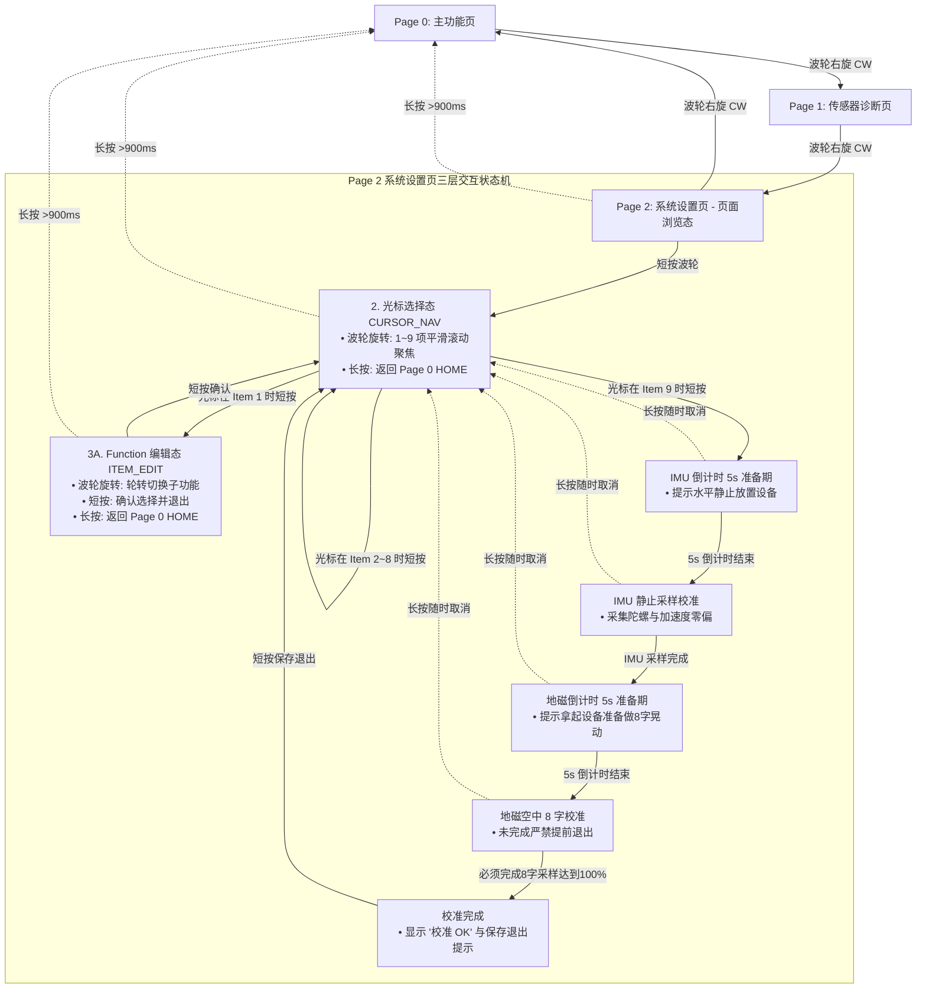

# 开发说明（dev_note）

本文档是 `ESP32S3_GPS_Codex` 固件的**开发需求与实现规格**：任务拓扑、数据契约、状态机、时序与并发约束，以及易踩坑清单。与 README.md（产品/硬件规格）配套使用。**编码前先通读本文档 §11 与 §12。**

> 📚 **文档导航**：
> - `README.md` — 产品/硬件规格、引脚表、编码约束 C-01~C-17
> - `dev_note.md`（本文）— 任务拓扑、数据契约、开发约束 D-01~D-16、踩坑清单
> - `DOC/ARCHITECTURE.md` — **驱动框架**（总线/驱动/汇聚/业务四层 + 版本 CI 策略）
> - `DOC/DEV_LOG/` — **开发日志**（独立保存，随 git 版本化，每次 commit 同步）
> - `DOC/SPEC/` — 器件规格书归档

---

## 1. 系统任务与责任

| 任务 | 栈/优先级 | 责任 | 关键接口 |
| --- | --- | --- | --- |
| `sensor_task` | 4096 / 8 | 驱动 `sensors_update()` 采样 IMU/GNSS/气压/电源，累积骑行/轨迹/P-Box 指标，推送 GPX 样本 | `sensors_update`, `sensors_get_state`, `gpx_logger_push_sample` |
| `diagnostic_task` | 4096 / 4 | 启动 5 s 每秒一次详细自检，之后 5 s 心跳 | `diagnostics_report_boot`, `diagnostics_report_heartbeat` |
| `input_task` | 4096 / 9 | 消费 `input_manager` 事件，负责模式切换、轨迹开关、P-Box 状态 | `input_manager_get_event`, `gpx_logger_start/stop` |
| `ui_task` | 8192 / 6 | 驱动 LVGL 视图层，刷新状态栏与五大模式界面 | `ui_*` 模块、`lv_timer_handler` |
| `input_manager` 内部任务 | 4096 / 9 | GPIO 中断读编码器 + 轮询按键：3-step 滤波、500 ms 空闲清零、短/中/长/双击判定 | `diagnostics_trigger_event` |
| `gpx_task` | 4096 / 5 | 处理 GPX 记录队列，按需写 SD | `gpx_logger_*` |

> **约束 D-01（优先级纪律）**：优先级从高到低 `input(9) > sensor(8) > ui(6) > gpx(5) > diagnostic(4)`，禁止调整；高优先级任务**禁止**持锁等待低优先级任务（防优先级反转）。

---

## 2. 数据结构与共享状态（数据契约）

- `sensors_state_t`：IMU、磁力计、气压计、电源、GNSS（含卫星数组 ≤32 颗）的统一快照。
  - **契约**：`sensors_get_state()` 返回**按值拷贝**；调用方禁止保存返回指针跨任务使用；`sensors.c` 内部用互斥锁保护。
- `system_context_t`：应用层运行态——模式枚举 `ui_mode_t`、骑行/轨迹里程与时间累计、P-Box 状态机（目标速度/已用时间/启动 tick）、设置菜单选项与 GNSS 刷新率。
- `ui_telemetry_t`：UI 刷新入参，封装 `sensors_state_t` 与 GPX 录制状态。

> **约束 D-02（所有权）**：每个结构体只允许一个写者（`sensor_task` 写 `sensors_state_t`，`input_task` 写模式/P-Box 状态），其余任务只读；跨任务传递用 FreeRTOS 队列（GPX 样本队列、输入事件队列、UI 更新队列）。

> **约束 D-03（NVS 命名空间）**：
> - `settings_store`：GNSS 刷新率、星座掩码、动态模式、P-Box 阈值、亮度。
> - `cal`：IMU 零偏、磁力计硬铁/软铁系数。
> - key 命名：小写下划线、≤15 字符；**只在值变化时写入**；GNSS 命令 ACK 成功后再持久化（先下发后落盘）。

---

## 3. 模式与输入映射（V0.3.0 3 大页面架构与设置页分层状态机）

- 旋转编码器（左旋 CCW / 右旋 CW）：
  - **默认页面浏览态（PAGE_NAV）**：循环切换 3 个大页面：`[Page 0: 主功能页] ↔ [Page 1: 传感器诊断页] ↔ [Page 2: 系统设置页]`。
  - **设置页光标选择态（CURSOR_NAV）**：在 Page 2 内部上下平滑移动光标选择条目（Item 1~9），视口自动随选平滑滚动（`lv_obj_scroll_to_view`）。
  - **Function 模式编辑态（ITEM_EDIT）**：在 Item 1 下轮转切换 `P-GEAR` ↔ `TRACK REC` ↔ `BIKE COMP`。
- Page 0 的子视图模式由系统设置 `FUNCTION MODE` 决定：
  - `MAIN_PAGE_PBOX` (0): P-Box 直线加速测试（默认）
  - `MAIN_PAGE_LOGGER` (1): TRACK REC 轨迹记录仪
  - `MAIN_PAGE_BIKE` (2): BIKE COMP 自行车码表
- 按键输入在各状态下的精确行为映射：
  - **短按（<800ms）**：
    - **Page 0 (P-Box)**：一键复位（RESET），重新进入就绪待机；
    - **Page 0 (轨迹记录)**：短按开启记录（防误触：开启短按）；
    - **Page 0 (码表)**：短按暂停/继续单次骑行；
    - **Page 2 (PAGE_NAV 页面浏览态)**：短按激活“光标选择态（CURSOR_NAV）”，显示焦点选择框；
    - **Page 2 (CURSOR_NAV 光标选择态)**：
      - 光标处于 Item 1 (`FUNCTION MODE`) 时：短按进入 `ITEM_EDIT` 波轮轮转编辑态；
      - 光标处于 Item 2~8 时：短按直接循环步进修改当前项预设值并即时生效；
      - 光标处于 Item 9 (`SENSOR CALIB`) 时：短按进入 `CALIB_FLOW` 独立传感器校准流程（启动 IMU 5s 倒计时）；
    - **Page 2 (ITEM_EDIT Function 编辑态)**：短按确认选中项并退出编辑态，即刻联动更新 Page 0 并回退到光标态；
    - **Page 2 (CALIB_FLOW 校准流程)**：严格限制只有在完成 8 字校准收敛完毕后界面显示“校准 OK”与保存退出提示，短按才将校准矩阵持久化至 NVS 并安全退出；在未完成 8 字校准前短按无效；
  - **长按（≥800ms，按满即触发无需等松手）**：
    - **即刻响应契约**：按下持续满 800ms 瞬间**立即发射事件并执行底层响应，绝不等松手**；松开按键时静默归位，绝不误触短按；
    - **Page 0 (轨迹记录)**：停止记录并安全关闭 GPX 文件落盘（防误触：长按停止）；
    - **Page 0 (码表)**：单次里程与极速清零（Trip Reset）；
    - **Page 1 / Page 2 (任意非校准态)**：随时全局快速返回 Page 0 (HOME)；
    - **Page 2 (CALIB_FLOW 校准流程)**：若未完成校准或需中途放弃，长按随时安全退出取消，回退至设置列表上级；
  - **双击（≤400ms）**：
    - **Page 1 (传感器诊断页)**：双击按键在“常规 4 卡片主视图”与“GNSS 原始报文监控终端流”之间无缝切换，再次双击切回；
    - 其余页面：预留扩展。

### 3.1 设置页三层交互状态机流程图 (Mermaid)



> **约束 D-04（输入时序与并发隔离）**：消抖 20 ms、短按 <250 ms、长按 >900 ms、双击间隔 <400 ms；**外部输入任务严禁跨线程直接调用 LVGL 控件**，UI 刷新由 `ui_timer_cb`（LVGL 自身任务）周期渲染，彻底杜绝死锁与 Task Watchdog 崩溃。

---

## 4. P-Box 状态机与测速逻辑

| 状态 | 进入条件 | 退出条件 | 行为 |
| --- | --- | --- | --- |
| READY | 默认开机 / 短按复位 | 直接深踩油门起步 → RUNNING | 等待弹射，计时归零 `00.00s` |
| RUNNING | 起步触发（车速≥1.5km/h 或 推力>0.25G） | 车速 ≥ 目标速度（默认 100 km/h）→ FINISHED；<br>或 2.5s 原地未动 → 自动复位 READY | 100Hz 高频采样，0.01s 毫秒精确计时，记录峰值 G |
| FINISHED | 达到 100 km/h 目标速度 | 短按 → READY | 成绩锁定，显示有效坡度与分段用时 |

- **启动条件（直接踩油门即触发）**：
  - 车辆原本处于静止或低速状态（< 3 km/h）；
  - 踩油门产生向前推力（综合动态线性加速度 > 0.25G）或 GPS 车速出现持续抬升（≥ 1.5 km/h），自动触发计时；
  - **防误触假起步保护**：起步后持续 2.5 秒内车速仍 < 2.0 km/h（判定为桌面晃动/手抖误触发），**自动重置回 `READY` 待机，计时清零**。
- **G-Force 雷达仪表**：水平位移 `px` 由横向 X 轴（`g_lat`）驱动，垂直位移 `py` 由纵向 Y 轴（`g_long`）驱动，动态红点居中，峰值 Peak G 实时捕获。
- **计时精度**：微秒级 `esp_timer_get_time()` 驱动，UI 定时器 50Hz (20ms)，呈现真实 **0.01s 毫秒级丝滑步进**。
- **测试数据清零**：初始显示 `--.-- s`，真实跑出 0-60km/h、0-100km/h、1/4 Mile (402m) 时填充并锁定显示。

---

## 5. UI 结构（基于 LVGL 9.5 与 ST7789 240×320 竖屏）

- **顶部常驻状态栏（20px）**：卫星数、定位状态、10Hz 频度、SD 状态（录制红闪烁）、本地时钟（UTC+8 / 系统秒）、电池电压与百分比、充电标志（`CHG`）。
- **底部常驻导航栏（16px）**：3 个页面指示圆点（Page 0/1/2），当前页拉长为高亮小椭圆。
- **中间视口容器（284px）**：
  - **Page 0（主功能页）**：内含 P-Box、轨迹记录仪、码表 3 套完整子视图，由系统设置项动态切换；
  - **Page 1（传感器诊断页）**：LSM6DSR（RAW ACC、**LIN ACC 线性加速度**、GYRO）、LIS2MDL（MAG、HEADING）、BMP388（PRS/T、**三传感器融合平均温度**、ALT）、NEO-M8N（STATUS、POS、**ALT 海拔高度、SPD 实时地速**、DOP）；四卡片 Y 轴与间隙精细分配，完全不重叠；
  - **Page 2（系统设置页）**：7 大配置条目，采用加大加粗的 **Oswald 14px** 字体，行距优化，末行底部留有 20px 缓冲，绝不贴底截断。
- **全量定制未压缩 Google Fonts 字库**：
  - `font_chakra_petch_48.c`（48px 科技仪表数字）
  - `font_chakra_petch_16.c`（16px 关键数值）
  - `font_oswald_14.c`（14px 卡片标题/设置名称）
  - `font_oswald_12.c`（12px 辅助标签）
  - `font_roboto_mono_12.c`（12px 诊断页等宽对齐数据与时钟）
  - 全字体挂载 `Montserrat_14` 为安全 Fallback，采用 `bitmap_format = 0` 未压缩直读点阵，免解压缩依赖。
  - 分辨率：`lv_display_get_horizontal_resolution()`
  - 定时器：`lv_timer_handler()` 仍在（ui_task 周期调用）
  - 颜色/字体/样式核心 API 不变（`lv_color_hex`、`lv_label_set_text`、`lv_obj_set_style_*`）
  - 底层端口（tick/显示/输入）统一由 `esp_lvgl_port` 封装，禁止手写 lv_display 注册

> **约束 D-05（LVGL 线程模型）**：全部 LVGL API 只允许在 `ui_task` 内调用；其他任务通过队列/标志请求 UI 更新，禁止直接调 `lv_*`；`lv_timer_handler` 轮询周期 5~10 ms。
> **约束 D-06（刷新频率）**：状态栏 ~1 Hz；速度/仪表 5~10 Hz；卫星列表随 GNSS 刷新率。禁止在每帧做重计算（如路径字符串拼接）。

---

## 6. 诊断与日志

- `diagnostics_init()` 初始化 UART0 日志通道。
- 启动 5 s：`diagnostics_report_boot()` 每秒输出 GNSS DOP、卫星 CN0、IMU/气压/磁力计/电源温度等全量信息。
- 之后每 5 s：`diagnostics_report_heartbeat()` 记录卫星数、速度、电量、温度。
- 输入事件：`input_manager` 生成事件时调用 `diagnostics_trigger_event()`，同步打印输入节奏与按压时长。
- 统一格式：`[DIAG][T=xxxxms] ... RESULT: OK/FAIL`。

> **约束 D-07（日志非阻塞）**：日志走 ESP_LOG 通道，禁止在日志路径做文件 I/O 或持锁；诊断只读共享快照。

---

## 7. 记录与存储（GPX）

- `gpx_logger` 事件队列驱动独立任务：
  - **START**：创建 `/GPX/ACT_xxxx.gpx`，写 `<gpx><metadata><time>`。
  - **SAMPLE**：写 `<trkpt>`（坐标/海拔/`<time>`）+ `<extensions>`（温度、三轴/总 G、气压、电池百分比、电压、模式/上下文含 P-Box 状态、骑行/轨迹距离、P-Box 计时）。
  - **STOP**：闭合标签并关闭文件。
- 队列深度由 `CONFIG_GPX_SAMPLE_QUEUE_DEPTH` 控制；采集任务仅在 `GPX_LOGGER_STATE_RECORDING` 时推送快照；**每个样本 `fflush`** 降低断电丢数据风险。
- 距离与时间累计逻辑与文件写入保持一致（同一份累计状态，禁止两处计算）。

> **约束 D-08（写盘纪律）**：`gpx_task` 是唯一写 SD 的任务；SD 挂载失败/写失败只置状态栏图标并记日志，**禁止阻塞 `sensor_task` 或 UI**；STOP 后必须 `fclose`，卸载前 `fflush`。
> **约束 D-09（时间格式）**：GPX `<time>` 一律 `YYYY-MM-DDTHH:MM:SSZ`（UTC）；无有效 GNSS 时间时禁止写伪造时间戳。

---

## 8. GNSS 数据路径

- `gnss_init()`：LDO 使能（GPIO14 高）→ 延时 ≥100 ms → **速率探测**：按 [9600 → 38400 → 115200] 依次试探，收到有效 NMEA 或 ACK 即锁定（NEO-M8N-0-01 与 ATGM336H **上电默认均为 9600**）→ 切到 115200：`UBX-CFG-PRT`（NEO-M8N，主）/ `PMTK251,115200`（ATGM336H，兼容保留）。
- 互斥保护的 `send_command_with_ack()` / `send_ubx_with_ack()` 并行下发 PMTK 与 UBX：`PMTK251/220/353`、`UBX-CFG-RATE/GNSS/NAV5`。
- 启动后按 `settings_store` 应用刷新率 / 星座掩码 / 动态模式：`gnss_set_update_rate()`、`gnss_set_constellations()`、`gnss_set_dynamic_mode()`。
- `gnss_poll()`：获取互斥后非阻塞读 UART，解析 `GGA/RMC/GSA/GSV`，更新 DOP、卫星列表、在用卫星数；RMC 时间戳转 `time_t`（2 位年 → 80 年窗口）。
- UBX ACK/NAK 按 (class, msgID) 匹配并写诊断日志。

> **约束 D-10（解析正确性）**：
> - NMEA 行缓冲 ≥128 B；UART RX ring buffer ≥ 2× 最大句长；**禁止在中断里做字符串解析**。
> - **GSV 多句累积**：按 total/sentence index + talker 分别累积，卫星数组上限 32，跨 talker 清空重开。
> - 校验和失败 / RMC 无效（`A` 标志缺失）/ 无 fix 的时间一律丢弃。
> - 配置命令独立等待 ACK，**超时 ≤500 ms**，失败重试 1 次后降级（保持上次可用配置），禁止阻塞式死等。
> - 双协议只采纳有 ACK 的一方；PMTK 用 `$PMTK001` 应答确认。

---

## 9. 传感器与校准

### 9.0 安装方向与轴向约定（2026-08-06 用户确认）

- **安装方式**：设备竖置（长边竖直），屏幕正对用户。
- **设备坐标**：X = 屏幕平面内水平（车前进方向，P-Box 纵向轴）；Y = 竖直向上（重力方向）；Z = 屏幕法线朝用户。
- **实现要求**：轴向映射（符号/轴交换）在 `config.h` 用宏参数化（`IMU_AXIS_*`）；启动自检用重力向量（应约等于 +1/-1 G 于某个轴）实测校验映射并打日志；P-Box 启动判定使用 X 轴（重映射后）。
- **旧文档“Z 反向、Y 不变”作废**（原为水平安装假设），改以竖置实测为准。

- `sensors_init()`：初始化 I2C/ADC 与充电状态 GPIO；依次唤醒 LSM6DSR、LIS2MDL、BMP388；校验芯片 ID（见 README C-02）；校准数据从 NVS `cal` 读取，缺省用零偏 + 单位软铁系数。
- `sensors_update()`：IMU 应用轴向翻转 + 偏移；磁力计 X/Y 交换、Y/Z 反向并按硬铁/软铁系数缩放；BMP388 官方补偿公式；电源用 oneshot ADC + line fitting（饱和保护见 README §3.4）。
- `sensors_start_calibration()` 后台 FreeRTOS 任务：IMU 采 512 个静止样本求均值；磁力计采 600 个 8 字摇晃样本求偏置 + 软铁系数；进度/提示通过 `sensors_calibration_status_t` 暴露给 UI；完成后写 NVS `cal`。

> **约束 D-11（校准状态机）**：校准期间禁止切换模式/停止采集；进度必须单调；UI 提示 “保持静止” / “8 字晃动” 与百分比实时同步；校准完成写 NVS 成功后才允许退出。

---

## 10. 设置菜单与持久化（9 大配置项契约与自动同步机制）

- `settings_store`：NVS 保存 9 项系统配置；`app_main` 启动时同步到 `system_context_t` 并立即应用。
- 9 项配置条目及其动作规范：
  1. **FUNCTION MODE**：`P-GEAR` (0) / `TRACK REC` (1) / `BIKE COMP` (2)；波轮轮转编辑，短按确认，实时切换主屏；
  2. **COLOR THEME**：`SUNLIGHT` (0) / `DARK` (1)；短按循环步进，全局色表与样式切换；
  3. **GPS RATE**：`10 HZ` / `18 HZ` / `1 HZ` / `5 HZ`；`PMTK220` + `UBX-CFG-RATE`，ACK 成功才写 NVS；
  4. **GNSS MODE**：`GPS+BDS` / `ALL GNSS` / `GPS ONLY`；`PMTK353` + `UBX-CFG-GNSS`，日志输出 ACK/NAK；
  5. **BRIGHTNESS**：`50%` (0) / `75%` (1) / `100%` (2) / `25%` (3)；与底层默认基线 50% 严格一致，动态调节 GPIO9 LEDC PWM 占空比并落盘；
  6. **AUTO SLEEP**：`3 MIN` / `5 MIN` / `NEVER` / `1 MIN`；无操作自动进入低功耗待机；
  7. **RTC AUTO SYNC**：`ON` (默认) / `OFF`；
     - **契约**：当处于 ON 时，GNSS 首次输出有效 3D Fix（RMC/ZDA 语句合法）后，立即提取 UTC 年月日时分秒，调用 `settimeofday()` 校准系统硬件时钟，并在状态栏时钟显示真实时间；
  8. **ALT AUTO CALIB**：`ON` (默认) / `OFF`；
     - **契约**：当处于 ON 时，开机后持续监听 GNSS 质量。在同时满足以下条件时执行**单次气压高度基准反算**：
       - a. GNSS 处于稳定 3D 定位状态（`fix_type >= 2`）；
       - b. 垂直精度置信度高（高度误差估计值 `< 5.0m`，且 `VDOP ≤ 2.5`）；
       - c. 气压计数据有效且平稳（最近 5 个采样方差极小）；
     - **执行动作**：以 GNSS 当前绝对椭球/大地高为准，依据国际标准大气公式反算当前海平面参考基准气压 $P_0$（QNH）或高度零偏 offset，修正 BMP388 测量基准；
     - **单次锁存保护**：置位全局 `s_alt_calibrated_this_boot = true`，**每次开机仅自动校准一次**，后续即使卫星跳变或进入建筑阴影也绝不重复校准，确保气压计相对高程测量的极佳连续性；
  9. **SENSOR CALIB**：短按启动真实传感器物理校准引擎（**坚决杜绝假进度条**）：
     - a. **IMU 校准前 5 秒准备倒计时**：界面大字显示 5s 倒计时，提示“请将设备水平平放好”；
     - b. **IMU 零偏真实校准**：设备必须保持真实水平静止，系统监测三轴动态角速度（<12 dps）与 1G 模长，**若检测到晃动进度条绝对停滞**；静止累计 30 组有效采样，计算陀螺零漂与重力对准参数；
     - c. **地磁校准前 5 秒准备倒计时**：界面大字显示 5s 倒计时，提示“请拿起设备准备在空中做 8 字晃动”；
     - d. **地磁空中 8 字真实校准**：用户在空间中做“8 字晃动”，系统追踪动态三维极值跨度与 8 个空间象限覆盖度；**若设备静止平放，进度条绝对为 0% 绝不上涨**！只有真实覆盖 ≥7 个空间象限且动态范围充足后才算 100% 收敛；
     - e. **完成判定**：只有在 8 字校准完全达标收敛后，状态机才置位 `CALIB_PHASE_DONE`，界面居中呈现显著的 **“校准 OK”**（`[OK] CALIBRATION SUCCESS`）字样与 **“保存退出”**（`SHORT: SAVE & EXIT`）提示；此时短按按键将校准参数落盘 NVS `cal` 分区，在运行时立即生效；
     - f. **安全放弃**：在以上任意阶段中，用户随时可通过长按（≥800ms）终止并丢弃未完成数据，安全回退上级。
- **全量设置与校准 NVS 持久化架构**：
  - 系统设置（功能模式、主题、刷新率、星座、亮度、休眠、RTC、高度校准）在用户修改时立即落盘至 NVS `"settings"` 分区；
  - 传感器校准数据（陀螺零漂、加速度偏置、磁力计硬铁偏移与软铁缩放矩阵）在校准完成后立即落盘至 NVS `"cal"` 分区；
  - 开机时系统优先从 Flash 载入，绝不上电重置！
- `diagnostics_trigger_event()` 在每次配置下发与校准落盘后打印详细事件日志。

### 10.1 自动同步与校准后台工作流 (Mermaid)

```mermaid
flowchart TD
    Start([开机启动 / GNSS 初始化]) --> Monitor[后台任务监听 GNSS 质量快照]

    subgraph RTC_Auto_Sync [1. RTC 自动同步]
        Monitor --> CheckRTC{RTC AUTO SYNC == ON?}
        CheckRTC -- 是 --> CheckGPSFix{GNSS 3D 定位有效?<br>卫星数 >= 4 且时间有效}
        CheckGPSFix -- 是 --> DoSync[提取 UTC 年月日时分秒<br>调用 settimeofday 同步系统硬件时钟]
        DoSync --> RTC_Done([RTC 同步完成 / 状态栏时钟生效])
        CheckGPSFix -- 否 --> Monitor
        CheckRTC -- 否 --> SkipRTC[跳过 RTC 同步]
    end

    subgraph Alt_Auto_Calib [2. 高度自动校准 (开机单次)]
        Monitor --> CheckAltSwitch{ALT AUTO CALIB == ON?}
        CheckAltSwitch -- 是 --> CheckCalibOnce{本次开机已校准过?}
        CheckCalibOnce -- 否 --> CheckQuality{GNSS 3D 定位良好?<br>VDOP <= 2.5 且垂直误差 < 5m<br>气压计读数平稳}
        CheckQuality -- 是 --> DoAltCalib[以 GNSS 高度为绝对基准<br>反算海平面基准气压 P0 (QNH)<br>校正气压计基准高度偏移]
        DoAltCalib --> LockCalib[置位: alt_calibrated_this_boot = true<br>本次开机锁存，后续绝不重复校准]
        LockCalib --> Alt_Done([气压计基准校准完成])
        CheckQuality -- 否 --> Monitor
        CheckCalibOnce -- 是 --> SkipAlt[开机已校准，保持锁定]
        CheckAltSwitch -- 否 --> SkipAltCalib[跳过自动校准]
    end
```

---

## 11. 开发约束清单（编码硬性要求）

| 编号 | 约束 |
| --- | --- |
| **D-01** | 任务优先级 `input(9) > sensor(8) > ui(6) > gpx(5) > diagnostic(4)`，禁止调整；防优先级反转 |
| **D-02** | 结构体单一写者；跨任务传递只走队列/快照拷贝 |
| **D-03** | NVS 命名空间与 key 规范；值变化才写；ACK 成功后才持久化 |
| **D-04** | 输入时序全走 `config.h` 宏；ISR 只置标志 |
| **D-05** | LVGL 单线程（`ui_task`）；跨任务 UI 更新走队列/标志 |
| **D-06** | 刷新频率分级（状态栏 1 Hz / 仪表 5-10 Hz）；禁止每帧重计算 |
| **D-07** | 日志非阻塞，禁止日志路径持锁或做文件 I/O |
| **D-08** | `gpx_task` 唯一写 SD；SD 失败只降级不阻塞；STOP 必 `fclose` |
| **D-09** | GPX 时间一律 UTC ISO8601，禁止伪造时间戳 |
| **D-10** | GNSS 解析：多句 GSV 累积、校验和、无效时间丢弃、ACK 超时 ≤500 ms、失败降级不阻塞 |
| **D-11** | 校准状态机：期间锁定模式，进度单调，NVS 写成功才退出 |
| **D-12** | **零魔数**：所有可调参数 `config.h`，UI 常量 `ui_common.h`，字符串 `strings.h` |
| **D-13** | 编译开 `-Wall -Werror`；头文件 `#pragma once`；函数前缀按模块 |
| **D-14** | 任何 `esp_err_t` 返回值必须处理；禁止 `(void)ret` 静默丢弃 |
| **D-15** | 大缓冲进 PSRAM（LVGL draw buffer / LCD DMA 描述符除外——按 ESP32-S3 约束），任务栈 ≤8 KB 进内部 RAM |
| **D-16** | 关键不变量用断言（边界、数组下标、状态机合法迁移），生产可关 |

---

## 12. 易踩坑清单（编码前逐条核对）

| # | 坑 | 对策 |
| --- | --- | --- |
| 1 | **GPIO26~32 被封装内 Flash/PSRAM 占用**（四线模式） | 引脚分配时先查 README §3.3 红线表 |
| 1b | **误配 Octal PSRAM 会吞掉 GPIO33~37**（与 SD 冲突） | `CONFIG_SPIRAM_MODE_QUAD=y`，禁止 OCT（README §3.3-2 / §8.2） |
| 2 | **SD 引脚表曾自相矛盾（旧文档）** | **已按原理图核实**：CLK=36/CMD=35/D0=37/D1=38/D2=34/D3=33（README §3.2），编码以 `config.h` 宏为准 |
| 3 | **GPIO3 是 strapping 引脚**（JTAG 源选择，规格书表 3-1：复位默认**浮空**） | 靠外部上拉保证复位为高；禁止改变时序/下拉 |
| 3b | **GPIO11=WATCHDOG（Q4 相关），暂不开发**；**Q3=LCD 背光驱动**（用户确认） | GPIO11 固件不驱动（保持输入/不初始化）；LCD 背光 = GPIO9 PWM → Q3（DTC123JCA）驱动背光 LED，**Q3 与看门狗无关**；Q4 接 WATCHDOG 网络，电路逻辑待确认 |
| 4 | **GPIO12=ADC2_CH1 且 1:1 分压 4.2 V 超量程** | 核实分压比；固件饱和保护；将来开 Wi-Fi 必须迁 ADC1 |
| 5 | **GNSS 已定 NEO-M8N-0-01（UBX/9600）；ATGM336H（PMTK/9600）位号备选** | 默认 UBX 协议栈；双协议下发只认 ACK 方；波特率探测 [9600→38400→115200]（README §3.5） |
| 5b | **替代料已定：LSM6DSRTR（原 LSM6DSVETR）、BMP388（原 BMP390L）、NEO-M8N-0-01（原 NEO-M9N-00B）** | 三组均为封装+引脚完全兼容；芯片 ID 宽松校验：IMU=0x6B（勿写 0x6A）、磁力计=0x40、气压计=0x50；**NEO-M8N 最多 3 星座并发**，4 星座会 NAK → 降级 GPS+GLONASS+BeiDou |
| 6 | **GSV 多句漏累积** | 按 total/index + talker 累积，上限 32，跨 talker 重置 |
| 7 | **NMEA 年份 2 位 → 时间戳错误** | 80 年滚动窗口（2000~2079），无效 fix 时间丢弃 |
| 8 | **LVGL 跨任务调用崩溃** | 全部 LVGL 调用锁在 `ui_task` |
| 9 | **等待 ACK 无超时 → 死等** | 所有等待 ≤500 ms 超时 + 重试 1 次 + 降级 |
| 10 | **高优先级持锁低速 I/O → 优先级反转** | 按 D-01，锁内禁止低速 I/O |
| 11 | **两处累计距离/时间 → 数据不一致** | 单份累计状态（§7），写文件与显示同一来源 |
| 12 | **ADC 未校准读值非线性** | oneshot + line fitting 校准；禁止直接读原始值 |
| 13 | **I²C 1 MHz 无外部上拉不稳** | 确认上拉；调试期降 400 kHz |
| 14 | **NVS 频繁写磨损** | 值变化才写；配置 ACK 成功才落盘 |
| 15 | **IDF/LVGL 版本漂移** | CI 锁定 release-v6.1 + LVGL 9.5.0 + esp_lvgl_port 2.8.0，`dependencies.lock` 入库；LVGL 9 与 8.x API 不兼容（lv_display_*/lv_screen_active/新 flush_cb），禁止按旧教程写 v8 代码 |

---

## 13. 后续扩展建议

1. **轨迹可视化**：GPS 记录界面叠加折线轨迹或缩略地图，提升现场复盘能力（注意 UI 刷新频率约束 D-06）。
2. **传感器融合**：Kalman 融合 IMU+GNSS 推算姿态/坡度，提升 P-Box 与骑行分析精度。
3. **连接能力**：BLE/Wi-Fi/USB CDC 传输 GPX 或实时数据 + OTA；注意 GPIO19/20 已预留、Wi-Fi 开启后 ADC2 不可用（README §3.4）。
